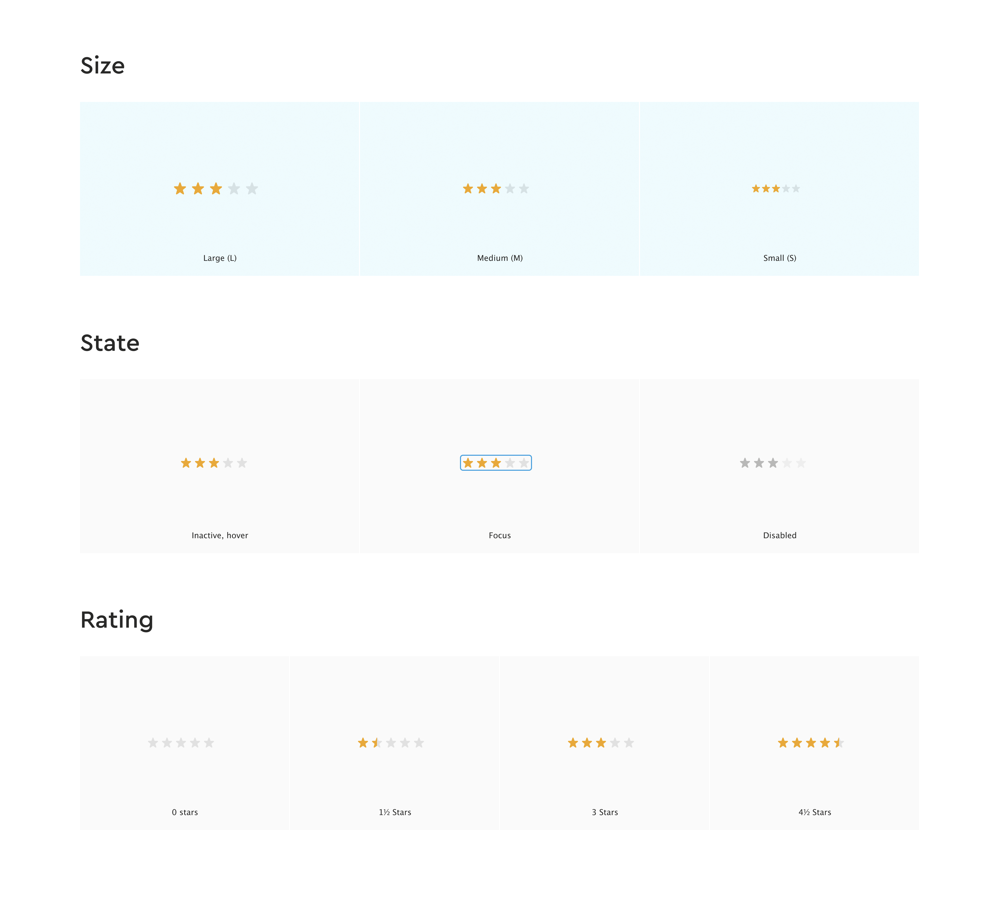
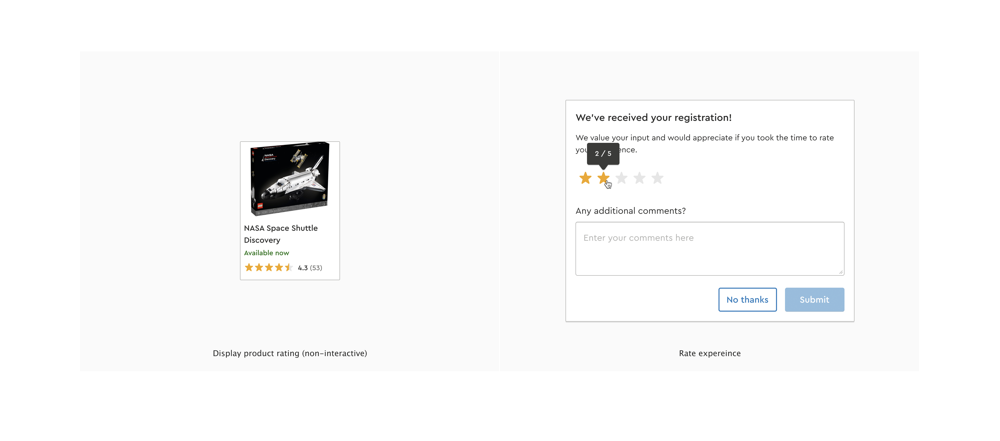

# Case
Imagine you're a contributor to a component library and you're being tasked with creating a new component. 
The new component you're going to be creating is a star rating component and below is the designs you've gotten from your designer. 

The component must be accessible and work in the majority of browser; Edge, Chrome, Firefox and Safari Mobile/Safari Desktop. 

**Tip:** Don't waste time on setting up a huge project from scratch. We have created a boilerplate for you to use. 

## Constraints for the solution:
* You must utilize web-components. We can recommend e.g. https://lit.dev/ and the included boilerplate is also based on Lit, but feel free to use any other framework to solve the case.
* You Must be using a open git repository. 
* We recommend usage of CSS variables for star color.

## Delivery expectations
* Accessibility has been prioritized.
* Keyboard and mouse support is available.
* Oral presentation of the solution, including an explanation about decisions, reflections and possible limitations of the solution.

## Considerations and reflections
* Presentation must take no more than 15-20 minutes.
* Consider committing often.

## What we are looking for:
* Code, Communication & Presentation skills
* Domain knowledge of frontend web development
* Analytical skills and a prioritized approach to delivering the best possible outcome.
* Being able to work structured under time pressure

